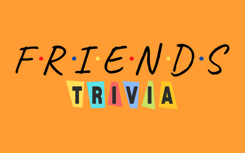

# F.R.I.E.N.D.S. trivia app

  

- A simple front-end trivia app based on the F.R.I.E.N.D.S TV show. Built with React Typescript and styled-components.

## Future developments

* Friends trivia questions REST API
* Back end to save and display high scores

## Contributions
- If you'd like to collaborate or contribute to this app, please email - neemavelasco@gmail.com

## Tests
- No tests as of the moment
